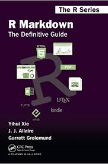
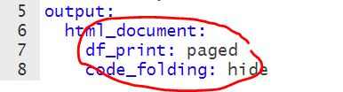
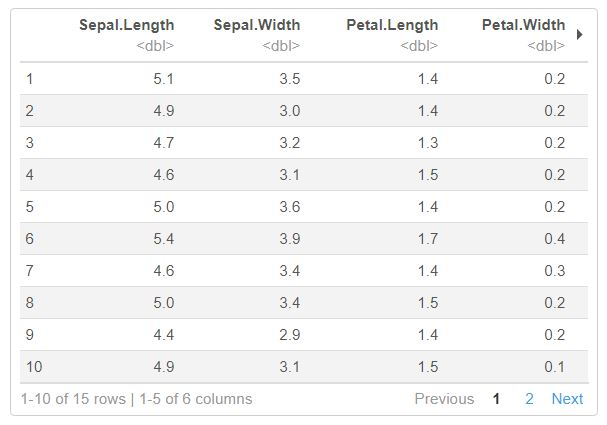
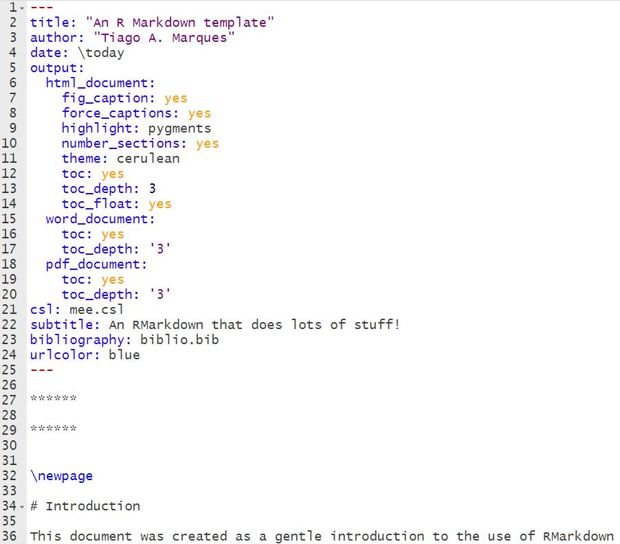
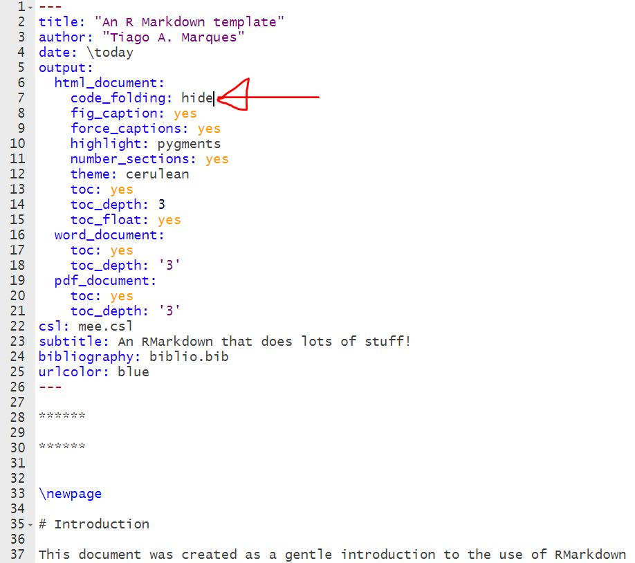

******

******


\newpage

# Introduction

This document was created as a gentle introduction to the use of RMarkdown for generating dynamic reports, embedded in a paradigm of reproducible research. For easier use one assumes that R Studio is being used.

The document was created is intended use is to be shared with folks new to RMarkdown, providing them a quick learning experience of some fundamental tips and tricks of things one often wants to do in a dynamic report by having an example template. 

By kniting this template and going back and forth over the .Rmd and comparing it with the output (html, pdf or word) one can see how the different features of RMarkdown are set up, and hence get up to speed with generating dynamic reports, almost without really knowing what you are doing. 

Doing something without really knowing what you are doing is usually a bad thing... but... I have come to realize that once folks see all the potential of the tool they are much more likely to continue to learn it by themselves. So the end justifies the means, at least in this case, in my opinion!

If you use this template drop me a line at tiago.marques@st-andrews.ac.uk. If you have any suggestions or comments please consider sending them to me.

This document is hosted at a git repository:

https://github.com/TiagoAMarques/RMarkdownTemplate


# Basic RMarkdown tricks

First, we load the `knitr` package that can be of help:

```{r}
library(knitr)
```

## Finding help online

There are so many resources online that is hard to list just a few, but just in case:

* An RStudio course on RMarkdown is here: https://rmarkdown.rstudio.com/lesson-1.html

At the corresponding RMarkdown sheat sheets are here:

* Here is the [link](https://rstudio.com/wp-content/uploads/2016/03/rmarkdown-cheatsheet-2.0.pdf) 

As you can seen, these are two different ways of providing links in RMarkdown!

A [free access definitive guide on RMarkdown](https://bookdown.org/yihui/rmarkdown/) by Yihui Xie, J. J. Allaire and  Garrett Grolemund is also here. If you don't find what you need there, you are really looking for something out of the ordinary:

Finaly, [Pimp my RMD: a few tips for R Markdown](https://holtzy.github.io/Pimp-my-rmd/)
by Yan Holtz contains several tips and tricks that might be useful.

## It is dynamic

To get us going we first generate two datasets in this folder, using an existing R data set.

```{r}
write.table(file="cars1to10.txt",cars[1:10,])
write.table(file="cars11to20.txt",cars[11:20,])
```

This allows us to confirm that the exact same code will produce different dynamic results, as a consequence of changing the data we are using.

The plot below will use the object `mydata` to make a plot.

```{r}
mydata <- read.table(file="cars1to10.txt")
plot(mydata)
```

The maximum value for `speed` in this file is `r max(mydata$speed)`. Note this is a dynamic value, we have not really written that number in the .Rmd text. Check the .Rmd to see how that is done,

Now, if after a while your collaborator sends you a new data set, in the non-reproducible research world you would ave to repeate it all. Not here. You just have to read the new data in and the exact same code can be used, now producing diferent results.


```{r}
mydata <- read.table(file="cars11to20.txt")
plot(mydata)
```

The maximum value for `speed` in this file is now `r max(mydata$speed)`. Dynamic values rock!

As an example, you can even print here when this document was compiled. This was compiled on `r date()`.

## Hyde and seek

We might want to show code and then the output of it

```{r}
a <- 3
b <- 4
a+b
```

but we might also just want to show code and no output

```{r,eval=FALSE}
a <- 3
b <- 4
a+b
```

or vice versa, just the output

```{r,eval=TRUE,echo=FALSE}
a <- 3
b <- 4
a+b
```

Note there are many such parameters that you can tweak in the code chuck headers, and you can find them in the cheat sheet I provided a link above for. 

# Adding References

One of the big dramas of large reports and thesis are generating references, properly formatted.

That is straingtforward in RMarkdown. This template shows you a way to do so, but you might consider exploring other alternatives. 

You need a file that contains the references (a bib file) and optionally a file that formats the references (I provide the mee.cls as an example). So here we use:

* biblio.bib
* mee.cls

Then, each time you want to cite a reference, you need to have it in the .bib file. For that I recomend using JABREF (https://www.jabref.org/), but any reference manager that can generate bibtex files will do. Each reference has associated with it a "BibtexKey". Then you just use that with an "@" in front to cite that reference.

As an example, here is a citation, a great resource for GLMs is @Faraway2006, and a good introduction to GAMs is @Wood2006. Ecological regression examples can be found in @Zuur2009b.

As you will see, these references will be present at the end of the document, in a suitably named section (I used "References"!).

Note that if there are funny characters in the .bib file you might face compiling problems!

If you need additional guidance in this process, there is a holding hands document called "StepByStep.pptx" that has a visual tutorial of all these steps with computer screenshots of what needs to be done to make this work. This should be fool proof. If you have any trouble with it please report and I'll update this document.

# Figures and Tables

## Figures

As you have seen above, we can include figures easily as outputs from R

```{r}
plot(rnorm(100))
```

However, we can actually include external images easily:



## Tables

If you want to include a table, you might just print it

```{r}
head(iris,15)
```

but that looks, let's face it, rather horrible. The next bext thing is to consider changing the yaml, and adding something to the html output `df_print: paged`, as in



Try it and you will get something like this



Another option be to explore the `kable` fuction, from package `knitr`, to help formating the table

```{r}
kable(cars,caption="A table with the dataset cars")
```

There are much fancier table types, and additional packages for table formatting. Take a peak e.g. here:

https://rfortherestofus.com/2019/11/how-to-make-beautiful-tables-in-r/

If you care to make an example using some of the additional table formatting packages found there (including `DT`,`gt`,`kableExtra`, `formattable`, `reactable` and/or `flextable`) please consider contributing it to this document. The tables you get from using `reactable` seem especially fancy, but getting them up and running seems to require some time investment.


# About output format

This template can be knited into an html, a pdf or word document. 

For pdfs you might need additional software installed like a Latex system.

We are currently it is optimized for html, so it might require minor tweaking for rendering pdf and word with optimal format. As an example of minor formatting differences depending on the compiling considered, in the pdf the date of compilation is outputed by default in the header, while that does not happen in the html.

The header of an .Rmd file contains yaml that allows one to control the document. There are many many features that you can costumize. 

Just as an example, try to add a line that says `code_folding: hide` and then try `code_folding: show`, so go from this



to this



and then compare what happens to the code in the html.

Note that you can control the output of each of the html, pdf and word documents separately, by changing arguments under the sub-headings under the `output:` heading, `html_document`, `word_document` and `pdf_document`, respectively.

# Contributors

Many folks have provided inputs and requests that have improved this document. 

If you have sent me inputs your name should be listed here. If it is not, plese complain!

# References


